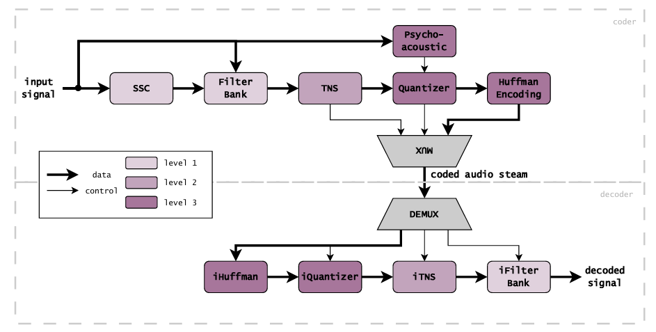

# AAC Audio Encoder & Decoder

## 📌 Project Overview
This project implements a simplified **Advanced Audio Coding (AAC)** encoder and decoder, inspired by the 3GPP TS 26.403 and MPEG AAC specifications. 

The implementation processes stereo audio signals (48kHz) and progressively applies Sequence Segmentation Control (SSC), MDCT Filterbanks (with SIN and KBD windows), Temporal Noise Shaping (TNS), a Psychoacoustic Model, Non-linear Quantization, and Huffman Entropy Coding to achieve perceptual audio compression.

## ⚙️ System Architecture
The following diagram illustrates the complete pipeline of the encoder and decoder. The processing blocks are color-coded according to the three implementation levels of the project (Level 1, Level 2, and Level 3).



## 📊 Key Results & Performance

The encoder successfully balances data compression with high acoustic fidelity by hiding quantization noise below the human hearing threshold.

* **Compression Ratio:** 4.49x (Bitrate reduced from 1536 kbps to ~342 kbps).
* **Signal-to-Noise Ratio (SNR):**
  * *Lossless stages (Level 1 & 2):* 33.28 dB (using SIN window).
  * *Lossy stage (Level 3):* 21.18 dB (Quantization noise is efficiently masked by the psychoacoustic model, making it imperceptible).
* **Bit Allocation:** 92.2% of the final bitstream is efficiently utilized for the quantized MDCT coefficients, demonstrating the effectiveness of the Huffman coding stage.

## 🚀 Setup & Execution

### Prerequisites
Ensure you have Python 3.x installed along with the required libraries:
```bash
pip install numpy scipy soundfile
```
### Running the Code
To run the full Level 3 encoding and decoding pipeline:

```bash
python demo_aac_3.py --input <audio.wav>
```
